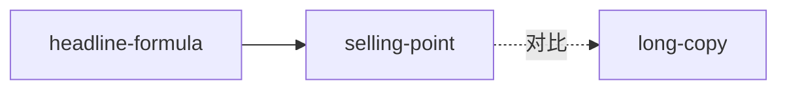

# 阶段 3 — Zettelkasten 链接

把孤立 skill 织成知识网络，提升可发现性与组合调用能力。

## 步骤

1. **找关系**：逐对比较 skill，判定关系类型：
   - **依赖**（A 需要先做 B）→ A 引用 B
   - **对比**（A 与 B 适用条件相反）→ 互相注明边界
   - **组合**（A+B 连续使用效果更好）→ 注明组合顺序
2. **回填**：在每个 SKILL.md 末尾补「相关 skills」段，并回填阶段 2 留下的 A2「与相邻 skill 区分」初稿，定稿。
3. **INDEX.md**：按 `references/templates/INDEX.md` 生成总览表 + mermaid 引用图（节点=skill，边=依赖/对比/组合）。
4. **GLOSSARY.md**：把 `candidates/glossary.md` 整理成 `books/<slug>/GLOSSARY.md`——它是所有 skill 的共享术语词典，不该埋在审计目录里。

## 引用图示例（mermaid）

## 输出

- `<slug>/INDEX.md`
- `<slug>/GLOSSARY.md`
- 各 `<skill-slug>/SKILL.md` 末尾「相关 skills」段
